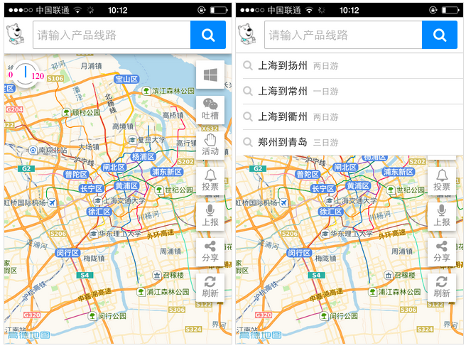
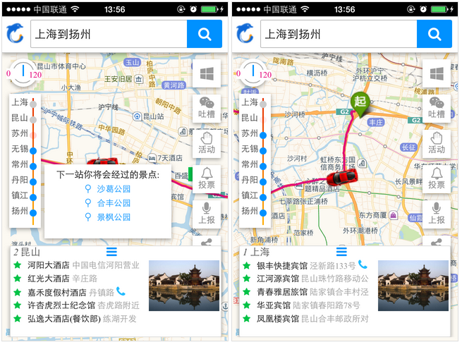
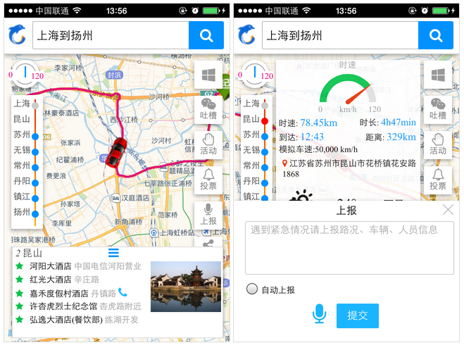

# Ctrip Hackathon: Predicting Bus Arrival Time
This project was developed within 24 hours and won 1st place at the Ctrip Hackathon. The approach to predicting bus arrival times has been implemented in the bus ticketing application.  
此作品是24小时内开发完成，获得携程黑客马拉松第1名。其中预测大巴达到时间的思路，在汽车票相关应用上线。   

           
           
        

Authors: 
Lihua Wang and Xiaojun Wei
     
